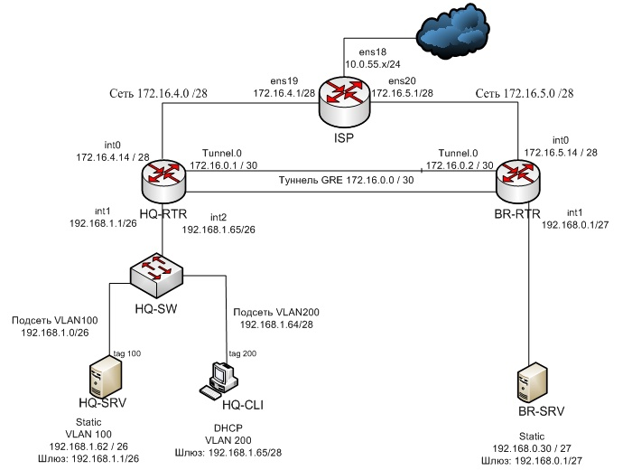

# Прочтите данное сообщение перед использование.

**1. Скрипты для роутеров ВВОДИТЬ РУЧКАМИ, скопировал вставил. Это легче чем использовать TFTP.**

**2. Вам нужно использовать скрипты на виртуальных маших отдельно и  нужно настраивать все постепенно: ISP, RTRы, Серверы и клиент**

**3.Чтобы использовать данный скрипт нужно выполнить одну команду:**

```apt-get update -y && apt-get install git -y && git clone https://github.com/OOTSOSI/demo25 && cd demo25/ && chmod +x ISP.sh && sh ISP.sh```
<br/>
```apt-get update -y && apt-get install git -y && git clone https://github.com/OOTSOSI/demo25 && cd demo25/ && chmod +x HQ-SRV.sh && HQ-SRV.sh```
<br/>
```apt-get update -y && apt-get install git -y && git clone https://github.com/OOTSOSI/demo25 && cd demo25/ && chmod +x BR-SRV.sh && sh BR-SRV.sh```
<br/>
<br/>
<br/>
Скрипт для управления стендами
```sh='PVE-ASDaC-BASH.sh';curl -sOL "https://raw.githubusercontent.com/PavelAF/PVE-ASDaC-BASH/main/$sh"&&chmod +x $sh&&./$sh -c https://disk.yandex.ru/d/HDgvq-iMbduqag -z;rm -f $sh```
<br/>

<br/>
<p align="center">
  
<p align="center"><strong>Топология</strong></p>
<br/>

<br/>
